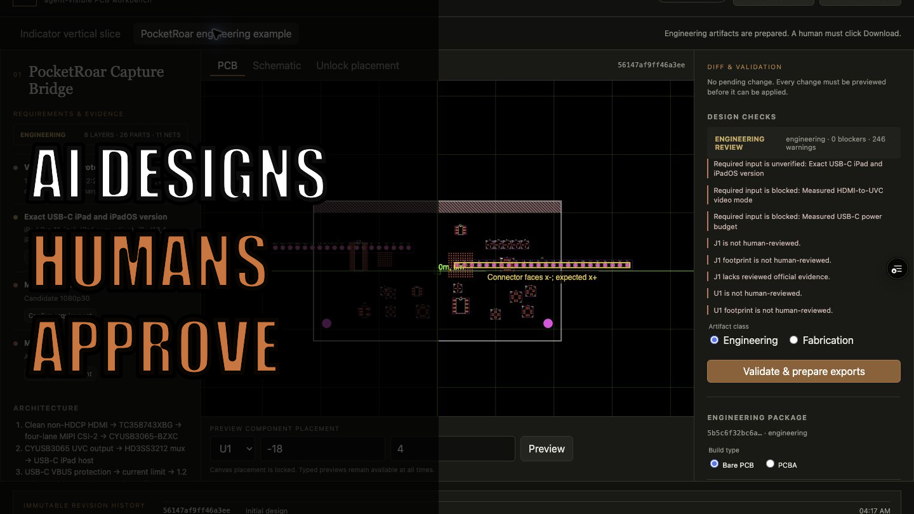

# RoarCAD

RoarCAD is a local-first browser PCB workbench where people and AI agents operate the same versioned `BoardGraph`. It supports custom 1–10 layer boards, exact parts and pin maps, library or embedded footprints, nets, differential pairs, placement, checks, editable PCB and schematic views, engineering/fabrication exports, four page-bound [WebMCP](https://developer.chrome.com/docs/ai/webmcp/) tools, and immutable team checkpoints.

- [Production app](https://roarcad.vercel.app)
- [Verified `dev` preview](https://roarcad-git-dev-jongan69s-projects.vercel.app)
- [Public source](https://github.com/jongan69/RoarCAD)

The two-layer indicator proves the fabrication-ready path. The included eight-layer PocketRoar Capture Bridge proves the same generic compiler on a complex design and exports a clearly marked engineering package. A third environmental-monitor sample proves that a new structured brief uses the same compiler without a project-name branch. PocketRoar cannot request a quote until its electrical, physical, licensing, and compatibility gates are proven.

The current product status, precise readiness vocabulary, retained research, and PocketRoar verification ladder are collected in the [wrap-up checkpoint](docs/PROJECT_CHECKPOINT.md). The interface now pairs each general part type with a plain-English definition while keeping exact technical data visible.

## Run

Requires [Bun](https://bun.sh).

```sh
bun install
bun run dev
```

Quality gates:

```sh
bun run typecheck
bun run check
bun test
bun run eval:webmcp
bun run build
```

## Workflow

1. Draft or import a structured custom `BoardGraph` containing geometry, parts, footprints, pins, nets, and constraints.
2. Inspect requirements, exact MPNs, official evidence, and unresolved risks.
3. Preview a structured change or explicitly unlock placement and drag a PCB component. The canvas is locked by default and a preview never mutates stored design state.
4. A person approves and applies the preview in the visible UI to create an immutable revision.
5. Validate the graph and generated Circuit JSON.
6. Prepare engineering or fabrication Gerber, BOM, placement, validation, digital-verification, project, and hash-manifest artifacts.
7. Explicitly download the package or request a JLCPCB quote.

Browsers without WebMCP retain the complete manual workflow. Agents cannot order, pay, store an address, or accept a substitution.

## WebMCP tools

- `draft_board`
- `inspect_design`
- `preview_design_change`
- `validate_and_export`

`draft_board` accepts requirements plus an optional structured `design`. `inspect_design` returns one focused, paginated section at a time. `preview_design_change` accepts allowlisted operations but cannot commit them. Supplier, agent, and shared-checkpoint evidence always enters unreviewed; only the visible manual UI can approve evidence, parts, footprints, or a pending change.

The complete structured schemas are exposed on the registered tools and are revalidated by Zod inside the application. Reproducible prompts for requirements-only, custom-board, change, export, and PocketRoar journeys are in [sample prompts](docs/SAMPLE_PROMPTS.md).

In Chrome, enable `chrome://flags/#enable-webmcp-testing` and relaunch before opening the hosted app. Unsupported browsers show **Manual mode** and retain the full workflow. Direct tool calls use the current Chrome contract: resolve the registered tool with `await document.modelContext.getTools()`, then call `document.modelContext.executeTool(tool, JSON.stringify(input))`.

## Team checkpoints

**Copy checkpoint link** packages the current immutable revision and ancestry into a gzip-compressed URL fragment. The fragment is not sent to Vercel, but anyone who receives it can read the design. A `.roarcad-checkpoint.json` download is available as a portable fallback.

A recipient reviews the checkpoint before choosing **Continue as local fork**. They can make and human-approve changes, then share a new checkpoint back. The original author sees the common ancestor and semantic diff before choosing **Adopt as new revision**. Divergent PCB graphs are never auto-merged, checkpoint integrity does not prove sender identity, and all incoming review claims are reset to unreviewed.

## Manufacturing status

The JLCPCB server boundary receives the current project and configuration, revalidates the revision, recompiles its artifacts, and rejects anything below `fabrication-ready`. It supports bare-PCB and PCBA configurations, server-side JLC signing, and expiring confirmed handoff tokens. Without an approved account-specific quote endpoint, it returns no invented price and directs the human to [JLCPCB's upload flow](https://jlcpcb.com/quote).

Server variables:

```text
JLCPCB_APP_ID
JLCPCB_ACCESS_KEY
JLCPCB_SECRET_KEY
JLCPCB_TOKENIZATION_PUBLIC_KEY
JLCPCB_TOKENIZATION_PRIVATE_KEY
JLCPCB_QUOTE_ENABLED=false
```

The tokenization keys remain unused unless an approved endpoint explicitly requires them. Protect `/api/manufacturing/jlcpcb/quote` with a Vercel WAF fixed-window rule of three requests per ten minutes per IP before enabling live quoting.

PocketRoar remains an **engineering-only UVC bridge study**. Its product target is iPhone, while USB-C iPad is the documented UVC comparison case. The current graph does not implement or prove the SeeMo-class compression and app-compatible iPhone transport that the product needs. The [iPhone inspiration research](docs/research/pocketroar-iphone-capture-inspiration.md), [electrical completion brief](docs/research/pocketroar-electrical-completion.md), and [verification ladder](docs/research/pcb-verification-ladder.md) record the transport, connector, power, firmware, simulation, compliance, manufacturing, and physical-test gates that still block fabrication and quoting.

## Screenshots




See the [domain glossary](CONTEXT.md), [architecture](docs/ARCHITECTURE.md), [safety limits](docs/SAFETY.md), [sample prompts](docs/SAMPLE_PROMPTS.md), [demo script](docs/DEMO.md), and [final video packet](docs/VIDEO_PACKET.md).

MIT © Jonathan Gan
