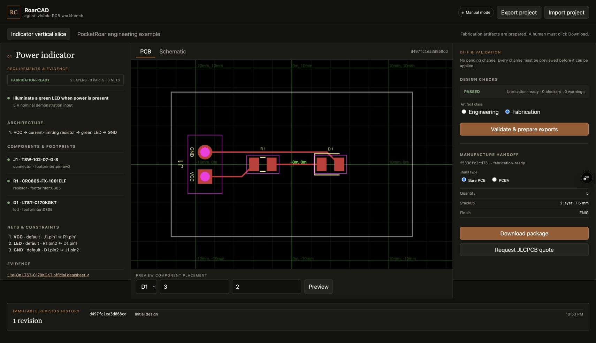
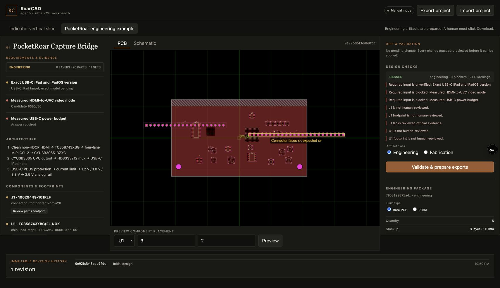

# RoarCAD

RoarCAD is a local-first browser PCB workbench where a human and an AI agent operate the same versioned `BoardGraph`. It supports custom 1–10 layer boards, exact parts and pin maps, library or embedded footprints, nets, differential pairs, placement, checks, editable PCB and schematic views, engineering/fabrication exports, and five page-bound [WebMCP](https://developer.chrome.com/docs/ai/webmcp/) tools.

- [Verified `dev` preview](https://roarcad-git-dev-jongan69s-projects.vercel.app)
- [Public source](https://github.com/jongan69/RoarCAD)

The two-layer indicator proves the fabrication-ready path. The included eight-layer PocketRoar Capture Bridge proves the same generic compiler on a complex design and exports a clearly marked engineering package. It cannot request a quote until its electrical, physical, licensing, and compatibility gates are proven.

## Run

Requires [Bun](https://bun.sh).

```sh
bun install
bun run dev
```

Quality gates:

```sh
bun run typecheck
bun run check
bun test
bun run build
```

## Workflow

1. Draft or import a structured custom `BoardGraph` containing geometry, parts, footprints, pins, nets, and constraints.
2. Inspect requirements, exact MPNs, official evidence, and unresolved risks.
3. Preview a structured change or drag a PCB component. A preview never mutates stored design state.
4. Approve and apply the preview to create an immutable revision.
5. Validate the graph and generated Circuit JSON.
6. Prepare engineering or fabrication Gerber, BOM, placement, validation, digital-verification, project, and hash-manifest artifacts.
7. Explicitly download the package or request a JLCPCB quote.

Browsers without WebMCP retain the complete manual workflow. Agents cannot order, pay, store an address, or accept a substitution.

## WebMCP tools

- `draft_board`
- `inspect_design`
- `preview_design_change`
- `apply_design_change`
- `validate_and_export`

`draft_board` accepts requirements plus an optional structured `design`. `preview_design_change` accepts allowlisted operations. Supplier and agent evidence always enters unreviewed; only the visible manual UI can approve evidence, parts, and footprints.

In Chrome, enable `chrome://flags/#enable-webmcp-testing` and relaunch before opening the hosted app. Unsupported browsers show **Manual mode** and retain the full workflow. Direct tool calls use the current Chrome contract: resolve the registered tool with `await document.modelContext.getTools()`, then call `document.modelContext.executeTool(tool, JSON.stringify(input))`.

## Manufacturing status

The JLCPCB server boundary receives the current project and configuration, revalidates the revision, recompiles its artifacts, and rejects anything below `fabrication-ready`. It supports bare-PCB and PCBA configurations, server-side JLC signing, and expiring confirmed handoff tokens. Without an approved account-specific quote endpoint, it returns no invented price and directs the human to [JLCPCB's upload flow](https://jlcpcb.com/quote).

Server variables:

```text
JLCPCB_APP_ID
JLCPCB_ACCESS_KEY
JLCPCB_SECRET_KEY
JLCPCB_TOKENIZATION_PUBLIC_KEY
JLCPCB_TOKENIZATION_PRIVATE_KEY
JLCPCB_QUOTE_ENABLED=false
```

The tokenization keys remain unused unless an approved endpoint explicitly requires them. Protect `/api/manufacturing/jlcpcb/quote` with a Vercel WAF fixed-window rule of three requests per ten minutes per IP before enabling live quoting.

PocketRoar remains an **engineering-only** example. Its current [electrical completion brief](docs/research/pocketroar-electrical-completion.md) identifies the proprietary-data, connector, power, firmware, simulation, compliance, and physical-test gates that still block fabrication and quoting.

## Screenshots





See [architecture](docs/ARCHITECTURE.md), [safety limits](docs/SAFETY.md), and the [demo script](docs/DEMO.md).

MIT © Jonathan Gan
